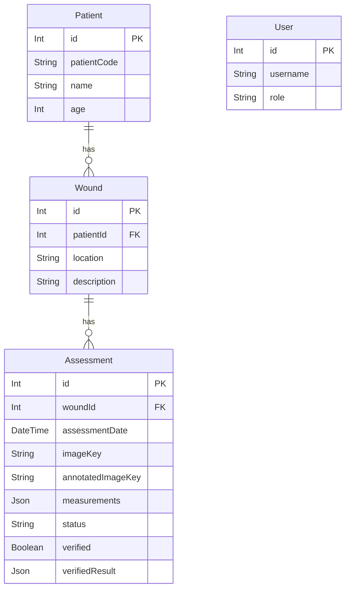

# 6. Database

CureSight AI uses PostgreSQL as the single source of truth for all clinical and application data, orchestrated via the Prisma ORM.

## Schema ER Diagram

## Important Models and Relationships

### 1. `Patient`
Represents the human subject.
- **`patientCode`**: A unique string identifier (e.g., `PT-001`) used extensively in the UI to avoid exposing internal primary keys (`id`).

### 2. `Wound`
Represents a specific physical location on a patient. A patient can have multiple wounds.
- **`location`**: General description of where the wound is located (e.g., "Left Leg").

### 3. `Assessment`
The core clinical record tracking a single photograph analysis session. A wound can have multiple assessments over time, forming a chronological progression timeline.
- **`imageKey`**: A string (e.g., `wounds/1790176031138-ndjopm4p7kd.jpg`) resolving to the raw unedited photo in the MinIO bucket.
- **`annotatedImageKey`**: The generated image containing the AI's masked boundaries and bounding boxes.
- **`measurements`**: A loosely typed `Json` field. It stores the complex Python dictionary generated by the FastAPI service (including `total_area_cm2`, `pixels_per_cm`, detection confidence, etc.).
- **`status`**: String indicating lifecycle state (e.g. `PENDING`, `COMPLETED`, `VERIFIED`).
- **`verified`**: Boolean indicating if a clinician has locked and signed off on the assessment.
- **`verifiedResult`**: A `Json` field storing the doctor's explicit manual overrides, notes, and final healing status.

### 4. `User`
Tracks system users for authentication.
- **`role`**: An enum (`DOCTOR`, `ADMIN`) controlling API access authorization boundaries.
