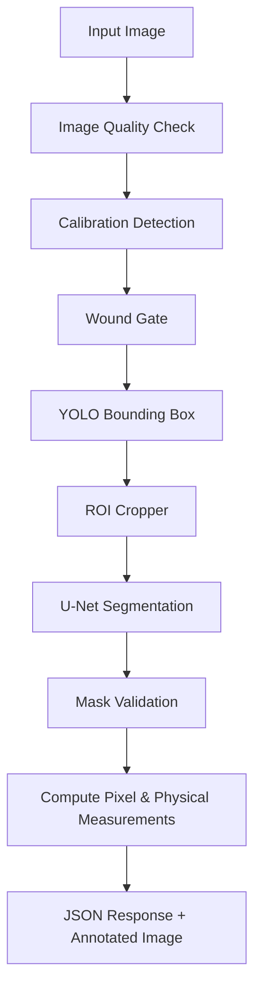

# 7. AI / ML Pipeline

The AI Pipeline is an orchestrated sequence executed within the Python FastAPI service. When an image is received via `POST /analyze`, the `MLPipeline` orchestrator (`ai_services/api/services/pipeline.py`) takes control.

## Conceptual Architecture vs Current Implementation

The pipeline architecture is designed to support deep learning models (YOLO for object detection and U-Net for precise segmentation). However, **no actual trained ML models are currently implemented in the repository.** The orchestrator is active, but the classes act as stubs leveraging deterministic OpenCV heuristics.

## Pipeline Flow

## Step-by-Step Breakdown

1. **Image Quality Validation**: (`ImageQualityAnalyzer`) Uses Laplacian variance to detect severe blur, rejecting the image if it falls below a strict threshold.
2. **Calibration Detection**: (`CalibrationDetector`) Scans the image for a specific physical reference marker.
3. **Wound Gate**: (`WoundGate`) Evaluates whether a wound exists in the image. *Currently a mock implementation that always returns `is_wound = True`.*
4. **Wound Detection**: (`YoloDetector`) Intended to generate bounding boxes isolating the wound. *Currently uses OpenCV contour detection on color-thresholded ranges (e.g. red/dark-red).*
5. **ROI Cropping**: (`ROICropper`) Extracts the bounding box region with padding to eliminate background noise for the segmenter.
6. **Segmentation**: (`UNetSegmenter`) Intended to perform semantic pixel-perfect segmentation. *Currently uses adaptive Gaussian thresholding and morphological operations (closing/opening) to generate a binary mask.*
7. **Validation**: (`SegmentationValidator`) Ensures the generated mask is sane (e.g., not >98% of the image, not <0.1% of the image).
8. **Measurements**: computes pixel area from the mask. If Calibration Detection succeeded, it applies the derived `pixels_per_cm` conversion scale to yield real-world cm² area and bounding dimensions.
