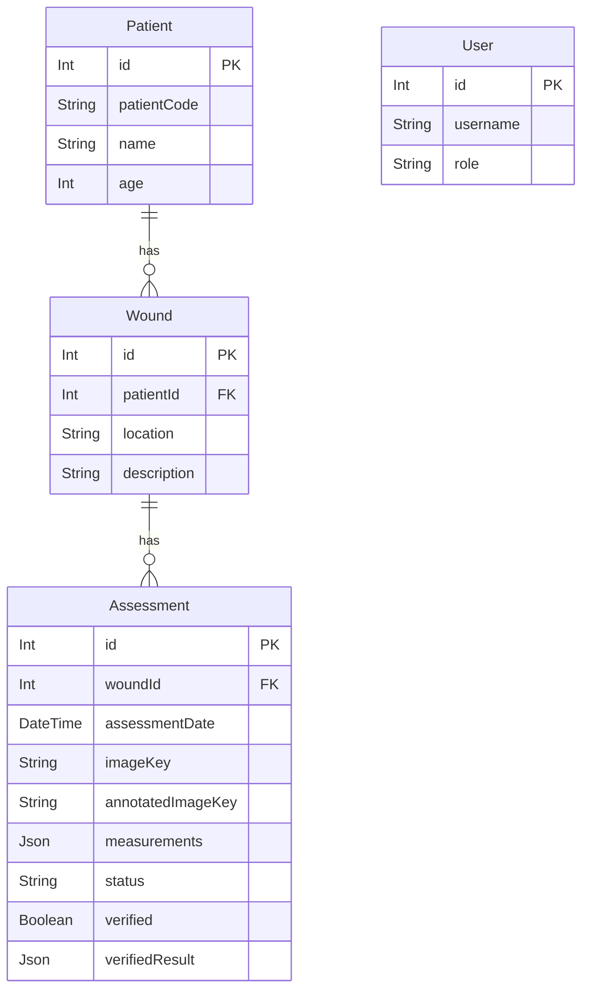
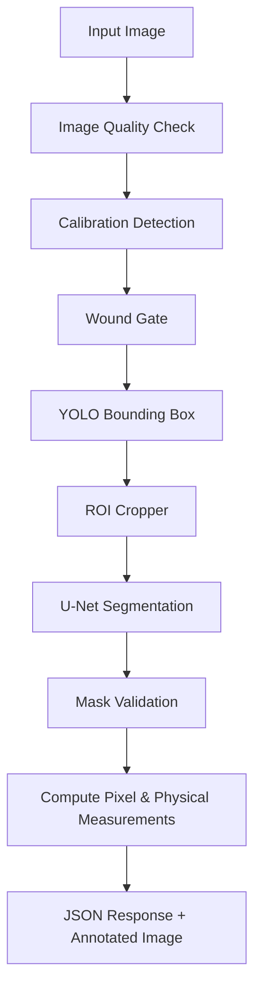

# CureSight AI: The Complete Developer Guide

Welcome to CureSight AI. This document serves as the master entry point for new engineers, data scientists, and product managers joining the project. 

It organizes our comprehensive documentation suite into a logical learning path.

---

## 30-Minute Understanding Path

If you need to understand this system quickly, read these core files in the repository:
1. `backend/prisma/schema.prisma` (Understand the data model)
2. `backend/src/server.ts` (Understand the Express routing and MinIO connections)
3. `ai_services/api/services/pipeline.py` (Understand the AI orchestrator)
4. `frontend/src/views/WoundAssessment.tsx` (Understand the main user operation)
5. `frontend/src/utils/api.ts` (Understand how the frontend talks to the backend)

## Guided Reading List

To understand the project conceptually without reading the source code, read the following documentation files in order:

### Part 1: The Big Picture
1. **[Project Overview](./01-project-overview.md)**: What problem are we solving?
2. **[System Architecture](./02-system-architecture.md)**: How do the Frontend, Backend, Database, and AI communicate?
3. **[Technology Stack](./03-technology-stack.md)**: Why did we choose React, Node, PostgreSQL, MinIO, and FastAPI?

### Part 2: Data & Backend
4. **[Database Schema](./06-database.md)**: How are Patients, Wounds, and Assessments linked?
5. **[Backend API](./05-backend.md)**: How does Node orchestrate the file uploads and database saves?
6. **[API Reference](./16-api-reference.md)**: The exact endpoints available.

### Part 3: The AI Engine
7. **[AI/ML Pipeline](./07-ai-ml-pipeline.md)**: How does the FastAPI service process an image?
8. **[Calibration & Measurement](./10-calibration-and-physical-measurement.md)**: How do we convert pixels into physical cm²? (Crucial safety invariant).
9. **[Image Processing & Segmentation](./09-image-processing-and-segmentation.md)**: How are the masks and bounding boxes drawn?

### Part 4: Clinical Interface
10. **[Frontend Applications](./04-frontend.md)**: How does the React SPA operate?
11. **[Assessment Lifecycle](./11-assessment-lifecycle.md)**: The journey from upload to verified clinical record.
12. **[Reports & PDF Generation](./13-reports-and-pdf-generation.md)**: How we generate static exports without a backend renderer.
13. **[Progress Analysis](./14-progress-analysis.md)**: Visualizing historical Frame A vs Frame B.

### Part 5: Infrastructure & Reality Check
14. **[Data Integrity & Safety](./15-data-integrity-and-safety.md)**: Why PostgreSQL is the single source of truth.
15. **[Project Status & Limitations](./18-project-status-and-limitations.md)**: What is actually implemented vs. what is a simulated stub.

---

## Glossary of Project Terms

- **Assessment**: A single chronological record of an AI analysis on a specific wound photograph. It has a `status` (PENDING, COMPLETED, VERIFIED).
- **Wound**: A physical location on a patient's body (e.g. "Left Leg"). A wound has many Assessments.
- **Patient**: A human subject tracked in the database, uniquely identified by a `patientCode` (e.g. PT-001).
- **Segmentation**: The process of separating the wound tissue from the surrounding healthy skin and background.
- **Mask**: A binary image overlay where white pixels represent the wound and black pixels represent the background.
- **ROI (Region of Interest)**: A cropped section of the image isolating the wound before segmentation.
- **YOLO (You Only Look Once)**: An object detection model architecture intended to find the ROI bounding box.
- **U-Net**: A deep learning architecture designed for biomedical image segmentation.
- **Calibration**: The process of detecting a known physical marker (a 2cm green square) in the image.
- **pixels_per_cm**: The conversion scale derived from Calibration, used to translate pixel area into physical cm².
- **Demonstration Calibration**: A hardcoded fallback scale used only for software testing when a real marker is absent.
- **Verification**: The explicit clinical sign-off by a Doctor. The AI does not diagnose; the doctor verifies.
- **imageKey**: The file path string (e.g., `wounds/123.jpg`) used to locate a specific photo in the MinIO bucket.
- **MinIO**: The S3-compatible local object storage server used for hosting raw and annotated images.
- **Prisma**: The Object-Relational Mapper (ORM) used by the Node.js backend to interface safely with PostgreSQL.
- **FastAPI**: The high-performance Python framework running the AI processing microservice.
# 1. Project Overview

## What is CureSight AI?

CureSight AI is an **AI-Powered Wound Intelligence Platform**. It is designed to assist clinicians in tracking, measuring, and analyzing patient wounds over time using standard digital photographs.

By automating the tedious and error-prone process of manually measuring wounds with paper rulers, CureSight AI aims to bring objective, reproducible data to wound care management. 

## Technical Objective

The technical goal of the project is to provide a complete full-stack web application that allows clinical users to upload wound images, process those images through a computer vision pipeline, extract physical measurements (area, width, length) using a known calibration reference, and securely store the resulting clinical assessments in a persistent database for reporting and historical progression analysis.

## Clinical Workflow

The system facilitates the following clinical workflow:

1. **Doctor / Clinician**: Authenticates into the secure platform.
2. **Patient**: The doctor selects or creates a patient record.
3. **Wound**: The doctor selects a specific wound site on that patient.
4. **Wound Photograph**: A photograph of the wound (ideally containing a green calibration marker) is uploaded.
5. **AI Analysis**: The photograph is sent to the AI service.
6. **Segmentation / Detection**: The system identifies the wound boundaries.
7. **Measurements**: Using the physical calibration marker, the system calculates real-world dimensions (cm² and cm).
8. **Assessment**: The AI findings are stored as an "Assessment" associated with the wound.
9. **Clinical Review**: The doctor reviews the AI-generated assessment.
10. **Verification**: The doctor verifies and approves the assessment, locking its clinical state.
11. **Reports / Historical Analysis**: The verified assessment becomes part of the patient's chronological timeline, allowing for PDF report generation and visual healing progression analysis.

## The Problem Being Solved

Traditional wound measurement relies on manual tracing or ruler approximations, leading to high inter-rater variability (different nurses get different measurements). CureSight AI attempts to solve this by providing a deterministic, mathematically consistent computer vision algorithm that derives exact pixel areas and converts them into physical dimensions using a standard reference scale.

## What the System Does vs. Does NOT Do

### What it DOES:
- Provides a secure interface for patient/wound management.
- Automates the extraction of wound boundaries from an image.
- Automatically detects a specific physical calibration marker (green square) to derive `pixels_per_cm`.
- Stores chronological assessments safely in PostgreSQL.
- Offers a structured workflow for clinicians to explicitly verify AI results.
- Provides visual tools to compare historical wound images (Frame A vs. Frame B).

### What it DOES NOT Do:
- **Autonomous Diagnosis**: CureSight AI is a **clinical decision support tool**. It does not autonomously diagnose the patient or prescribe treatments. The final verification is always performed by a human.
- **Predictive Healing**: The system tracks historical data but *does not currently implement* predictive ML models that forecast when a wound will heal.
- **Real ML Inference (Currently)**: *Demonstration functionality:* The current AI pipeline orchestrator exists, but the underlying YOLO/U-Net models are currently stubbed/mocked with OpenCV heuristic fallbacks. The architecture is ready for real weights, but they are not present.

> **Demonstration / Testing functionality:** Throughout the platform, you may see fallback calibration scales or "Demonstration" markers. These exist solely to allow software testing without requiring a real physical marker in every test image. They are strictly prevented from masquerading as actual physical measurements.
# 2. System Architecture

The CureSight AI application follows a modern decoupled architecture consisting of four primary layers: a React frontend, a Node.js API backend, a PostgreSQL relational database, and a FastAPI-based AI service with local MinIO object storage.

## Architecture Diagram

```mermaid
flowchart TD
    subgraph Client Layer
        UI[React Frontend (Vite)]
    end

    subgraph API Layer
        Node[Node.js / Express Backend]
        Prisma[Prisma ORM]
    end

    subgraph AI/ML Layer
        FastAPI[FastAPI Python Service]
        Pipeline[ML Pipeline Orchestrator]
        OpenCV[OpenCV Calibration / Masks]
    end

    subgraph Data Layer
        PG[(PostgreSQL Database)]
        MinIO[(MinIO Object Storage)]
    end

    UI <-->|JSON REST API| Node
    Node <-->|Prisma Queries| PG
    Node <-->|S3 API| MinIO
    Node <-->|HTTP Multipart| FastAPI
    FastAPI --> Pipeline
    Pipeline --> OpenCV
```

## Component Responsibilities

### 1. React Frontend (Vite)
- Renders the clinical user interface (Dashboards, Reports, Progress Analysis).
- Manages local client state and API communication.
- Handles JWT authentication storage.
- Enforces UI-side loading, error, and empty states based on API responses.

### 2. Node.js Backend (Express)
- Acts as the central traffic controller for the platform.
- Handles user authentication (JWT generation/verification).
- Protects endpoints and manages authorization.
- Interfaces with the database via Prisma to read/write Patients, Wounds, and Assessments.
- Uploads images to MinIO, forwards them to the AI service, and aggregates the results into a single transactional save.

### 3. FastAPI AI Service
- A Python-based microservice strictly responsible for image processing.
- Exposes an `/analyze` endpoint receiving multipart image files.
- Executes the `MLPipeline` to perform image quality checks, ROI cropping, wound segmentation, and calibration detection.
- Returns a structured JSON payload containing pixel measurements, physical measurements (if calibrated), and base64-encoded annotated images back to the Node.js backend.

### 4. PostgreSQL (Database)
- The absolute single source of truth for all clinical and application data.
- Stores heavily relational data linking Doctors (Users) to Patients, Wounds, and Assessments.
- Maintains strict consistency for assessment verification states and JSON-structured measurement results.

### 5. MinIO (Object Storage)
- Serves as the S3-compatible file storage mechanism.
- Stores raw uploaded wound images and their corresponding AI-annotated masks securely.
- Files are referenced by PostgreSQL using deterministic `imageKey` paths (e.g., `wounds/123.jpg`).
# 3. Technology Stack

CureSight AI relies on a robust and modern stack, separating web application concerns from heavy AI compute concerns.

## Stack Overview

| Layer | Technology | Purpose |
| :--- | :--- | :--- |
| **Frontend** | React (Vite, TypeScript), TailwindCSS | High-performance, statically-typed UI rendering and styling. |
| **Backend** | Node.js (Express, TypeScript) | Fast, asynchronous web server managing business logic and API routing. |
| **Database** | PostgreSQL + Prisma ORM | Relational data persistence and type-safe schema modeling. |
| **Object Storage** | MinIO | S3-compatible, locally-hosted image storage for wound photos. |
| **AI API** | Python, FastAPI | High-performance Python microservice optimized for data science workloads. |
| **ML / CV** | OpenCV (`cv2`), NumPy, Scikit-Image | Image matrix manipulations, color thresholding, mask generation. |
| **Authentication**| JSON Web Tokens (JWT) | Stateless, secure authentication between the React frontend and Node backend. |
| **Testing** | Pytest, TypeScript compiler | Backend AI pipeline tests and strict frontend type validations. |
| **Infrastructure**| Docker & Docker Compose | Containerization for PostgreSQL and MinIO databases. |

## Why these technologies?

### React + TypeScript + Vite
Wound care requires highly interactive interfaces (e.g., comparing historical images side-by-side). React provides component-driven architecture, while TypeScript ensures that complex JSON assessment data passed from the backend is handled without runtime type errors.

### Node.js + Prisma + PostgreSQL
Node.js serves as an excellent IO-bound gateway, perfect for orchestrating file uploads and database reads. Prisma provides complete end-to-end type safety, ensuring that changes to the PostgreSQL schema immediately flag TypeScript errors if the backend API isn't updated to match. PostgreSQL was chosen for its strict ACID compliance, essential for clinical data integrity.

### FastAPI + OpenCV
Python is the lingua franca of machine learning. FastAPI provides asynchronous, rapidly-serializable API endpoints. While the platform is designed to eventually run PyTorch (YOLO/U-Net) models, the current iteration leans heavily on OpenCV for algorithmic calibration detection and contour approximation, which OpenCV handles exceptionally fast on CPU.

### MinIO
Storing images directly in PostgreSQL as BLOBs is a major anti-pattern that bloats database size and kills performance. MinIO provides an S3-compatible object storage layer that runs locally in Docker, allowing the system to scale image storage infinitely while keeping the PostgreSQL database lightweight.
# 4. Frontend

The frontend is a Single Page Application (SPA) built using React, TypeScript, and Vite.

## Routing and Authentication Flow

The application routing strictly protects clinical data.

1. **Login**: The user enters credentials at `/login`.
2. **Authentication**: A POST request is sent to `/api/auth/login`. If valid, the Node backend returns a JWT token.
3. **Session Storage**: The JWT is stored in `localStorage` and bound to the application's `AuthContext`.
4. **Protected Application**: Protected routes (Dashboard, Patients, Reports) wrap content in an `<AuthGuard>`. If the token is missing or invalid, the user is immediately redirected to `/login`.

## API Communication

All API calls are routed through a standardized helper function `apiFetch()` (`frontend/src/utils/api.ts`). This utility automatically attaches the `Authorization: Bearer <token>` header to every outgoing HTTP request to ensure secure communication with the Node.js backend.

## Major Views & Components

### `Dashboard.tsx`
Provides an overview of the system state. It fetches real-time aggregations from PostgreSQL via `/api/dashboard/summary`, displaying metrics like active patients, wound counts, and verified assessments.

### `WoundAssessment.tsx`
The primary operational screen. Allows the user to select a patient, select a wound, upload an image, and trigger the AI pipeline. It includes forms for manual data input and visualizes the AI's response before submission.

### `ProgressAnalysis.tsx`
A historical comparison tool. Users select a patient and wound to view a chronological timeline of healing. It dynamically queries `/api/assessments?woundId=...` to render the timeline and provides a "Professional Image Comparison" view to analyze `Frame A` vs `Frame B`.

### `Reports.tsx`
Displays all `COMPLETED` and `VERIFIED` clinical reports. It features a modal that generates on-the-fly downloadable PDF exports summarizing the physical measurements and annotations.

## Data Flow: PostgreSQL as the Source of Truth

The frontend operates on a strict **Database-Driven** model. 
- **No mock data**: Patients and Wounds populate dropdowns via direct `GET /api/patients` and `GET /api/wounds` calls. 
- **No detached state**: If an assessment is completed or verified, the UI updates its state by re-fetching the data from the server, ensuring that what the user sees is exactly what is stored in PostgreSQL.

> **Demonstration / Testing functionality:** The UI correctly identifies and labels AI calibrations that use the "Demonstration Fallback Scale" to ensure clinicians are never misled by test data.
# 5. Backend

The CureSight Node.js (Express) backend functions as the primary security gateway and data orchestrator for the platform.

## Server Structure

The primary entry point is `backend/src/server.ts`. It initializes the Express application, configures CORS, connects the Prisma ORM to PostgreSQL, establishes the MinIO object storage connection, and registers all API routes.

## Core Responsibilities

1. **Authentication**: Exposes `/api/auth/login` and validates all incoming requests using JWT middleware.
2. **Database Operations**: Handles full CRUD (Create, Read, Update, Delete) operations for Patients, Wounds, and Assessments using strict Prisma schemas.
3. **Storage & AI Broker**: Receives image uploads via `multer`, pipes them to MinIO, streams them to the Python AI service for analysis, and parses the response.

## API Route Table

The following routes are actively implemented and confirmed in the repository:

| Method | Endpoint | Purpose | Auth Required | Source Data |
| :--- | :--- | :--- | :--- | :--- |
| `POST` | `/api/auth/login` | Authenticate user | No | `User` |
| `GET` | `/api/auth/me` | Retrieve active user profile | Yes | JWT Payload |
| `GET` | `/api/dashboard/summary`| Aggregate global clinical stats | Yes | `Patient, Wound, Assessment` |
| `GET` | `/api/patients` | Retrieve all patients | Yes | `Patient` |
| `GET` | `/api/wounds` | Retrieve wounds by `?patientId=` | Yes | `Wound` |
| `GET` | `/api/assessments` | Retrieve assessments by `?woundId=`| Yes | `Assessment` |
| `PATCH` | `/api/assessments/:id/verify`| Mark assessment as verified | Yes | `Assessment` |
| `GET` | `/api/reports` | Retrieve all COMPLETED & VERIFIED | Yes | `Assessment` |
| `POST` | `/api/upload` | Orchestrate AI pipeline and storage | Yes | Multipart Image -> AI -> PG |
| `GET` | `/api/images/:key` | Serve image binaries from MinIO | Yes | MinIO `wound-images` bucket |

## The AI Orchestration Flow (`POST /api/upload`)

When a user submits a new wound photograph:
1. Express intercepts the file using `multer`.
2. The file is uploaded directly to the local MinIO `wound-images` bucket under `wounds/{timestamp}-{id}.jpg`.
3. Express constructs a form-data request and forwards the image to the FastAPI Python service at `/analyze`.
4. The Python service returns a JSON payload containing segmentation, pixel measurements, and calibration status, alongside a base64 string of the annotated image.
5. Express decodes the base64 annotated image and uploads it to MinIO under `analysis/{timestamp}/annotated.jpg`.
6. Express creates a new `Assessment` record in PostgreSQL via Prisma, storing both the `imageKey`, `annotatedImageKey`, and the raw `measurements` JSON.
# 6. Database

CureSight AI uses PostgreSQL as the single source of truth for all clinical and application data, orchestrated via the Prisma ORM.

## Schema ER Diagram



## Important Models and Relationships

### 1. `Patient`
Represents the human subject.
- **`patientCode`**: A unique string identifier (e.g., `PT-001`) used extensively in the UI to avoid exposing internal primary keys (`id`).

### 2. `Wound`
Represents a specific physical location on a patient. A patient can have multiple wounds.
- **`location`**: General description of where the wound is located (e.g., "Left Leg").

### 3. `Assessment`
The core clinical record tracking a single photograph analysis session. A wound can have multiple assessments over time, forming a chronological progression timeline.
- **`imageKey`**: A string (e.g., `wounds/1790176031138-ndjopm4p7kd.jpg`) resolving to the raw unedited photo in the MinIO bucket.
- **`annotatedImageKey`**: The generated image containing the AI's masked boundaries and bounding boxes.
- **`measurements`**: A loosely typed `Json` field. It stores the complex Python dictionary generated by the FastAPI service (including `total_area_cm2`, `pixels_per_cm`, detection confidence, etc.).
- **`status`**: String indicating lifecycle state (e.g. `PENDING`, `COMPLETED`, `VERIFIED`).
- **`verified`**: Boolean indicating if a clinician has locked and signed off on the assessment.
- **`verifiedResult`**: A `Json` field storing the doctor's explicit manual overrides, notes, and final healing status.

### 4. `User`
Tracks system users for authentication.
- **`role`**: An enum (`DOCTOR`, `ADMIN`) controlling API access authorization boundaries.
# 7. AI / ML Pipeline

The AI Pipeline is an orchestrated sequence executed within the Python FastAPI service. When an image is received via `POST /analyze`, the `MLPipeline` orchestrator (`ai_services/api/services/pipeline.py`) takes control.

## Conceptual Architecture vs Current Implementation

The pipeline architecture is designed to support deep learning models (YOLO for object detection and U-Net for precise segmentation). However, **no actual trained ML models are currently implemented in the repository.** The orchestrator is active, but the classes act as stubs leveraging deterministic OpenCV heuristics.

## Pipeline Flow



## Step-by-Step Breakdown

1. **Image Quality Validation**: (`ImageQualityAnalyzer`) Uses Laplacian variance to detect severe blur, rejecting the image if it falls below a strict threshold.
2. **Calibration Detection**: (`CalibrationDetector`) Scans the image for a specific physical reference marker.
3. **Wound Gate**: (`WoundGate`) Evaluates whether a wound exists in the image. *Currently a mock implementation that always returns `is_wound = True`.*
4. **Wound Detection**: (`YoloDetector`) Intended to generate bounding boxes isolating the wound. *Currently uses OpenCV contour detection on color-thresholded ranges (e.g. red/dark-red).*
5. **ROI Cropping**: (`ROICropper`) Extracts the bounding box region with padding to eliminate background noise for the segmenter.
6. **Segmentation**: (`UNetSegmenter`) Intended to perform semantic pixel-perfect segmentation. *Currently uses adaptive Gaussian thresholding and morphological operations (closing/opening) to generate a binary mask.*
7. **Validation**: (`SegmentationValidator`) Ensures the generated mask is sane (e.g., not >98% of the image, not <0.1% of the image).
8. **Measurements**: computes pixel area from the mask. If Calibration Detection succeeded, it applies the derived `pixels_per_cm` conversion scale to yield real-world cm² area and bounding dimensions.
# 8. Datasets and Model Training

> **Not currently implemented.**

The CureSight AI repository currently functions purely as an architectural skeleton and web platform.

## ML Architecture Status

While the Python backend includes classes for `YoloDetector` and `UNetSegmenter`, there are **no training scripts, dataset preprocessing pipelines, datasets, or `.pt`/`.pth` weight files** present in the repository.

The system relies entirely on hardcoded OpenCV color-thresholding and contour heuristics to simulate the presence of an AI.

## Requirements for Future Implementation

To fully realize the clinical potential of the platform, the following will need to be developed:
1. **Clinical Image Dataset**: A large repository of diverse wound images (various skin tones, lighting conditions, wound types).
2. **Annotation**: Ground-truth polygon masks delineating the exact wound beds.
3. **Training Scripts**: A PyTorch/TensorFlow pipeline for fine-tuning a YOLOv8 (or similar) architecture for the ROI cropper, and a U-Net architecture for the semantic segmenter.
4. **Validation/Testing**: A dedicated hold-out test set to verify intersection-over-union (IoU) and Dice scores before deployment.

### Clinical Validation

**Clinical validation has not yet been performed.** 
The platform cannot currently be used to accurately measure real-world clinical wounds outside of specifically staged, highly-contrasted test photographs.
# 9. Image Processing and Segmentation

Since the U-Net and YOLO ML models are currently stubbed, the image processing pipeline relies heavily on deterministic computer vision techniques via the `OpenCV` (`cv2`) library.

## Detection and Masking Process

1. **Color Space Conversion**: The image is converted from BGR (OpenCV default) to HSV (Hue, Saturation, Value) to isolate colors independent of lighting intensity.
2. **Thresholding**: The `YoloDetector` stub targets ranges consistent with wound tissue (reds and dark hues).
3. **Morphological Operations**: 
   - A closing operation (`cv2.morphologyEx` with `cv2.MORPH_CLOSE`) is used to fill small holes inside the thresholded regions.
   - An opening operation removes small scattered noise.
4. **Contour Extraction**: `cv2.findContours` locates the boundaries of the remaining continuous shapes. The largest contour is assumed to be the wound.
5. **Bounding Box**: A bounding rectangle (`cv2.boundingRect`) is drawn around the selected contour.
6. **Mask Generation**: A binary mask is created, assigning a value of `255` (white) to pixels inside the contour, and `0` (black) to everything else.

## Mathematical Measurement Calculations

The `WoundMeasurements` service translates the generated mask into physical data.

### 1. Pixel Area
The exact pixel area is calculated using:
```python
pixel_area = cv2.contourArea(contour)
```

### 2. Physical Area (cm²)
If the image was successfully calibrated to determine `pixels_per_cm`:
```python
pixels_per_cm2 = pixels_per_cm * pixels_per_cm
physical_area_cm2 = pixel_area / pixels_per_cm2
```

### 3. Physical Dimensions (Length & Width)
The bounding rectangle (`w`, `h` in pixels) is divided by the `pixels_per_cm` scale to extract physical length and width in cm.

### Image Annotation
The pipeline utilizes `cv2.drawContours` and `cv2.rectangle` to visually overlay the generated mask and bounding box onto the original image, ensuring the clinician can visually verify exactly what the algorithm calculated.
# 10. Calibration and Physical Measurement

Converting a 2D image pixel into a 3D physical dimension requires a reliable reference scale. CureSight AI utilizes a strictly enforced calibration protocol to ensure clinical safety.

## 1. Automatic Physical Calibration (The Primary Method)

The system expects the clinician to place a standard **2 cm × 2 cm green square marker** near the wound prior to taking the photograph.

### Detection Algorithm (`CalibrationDetector`)
1. **HSV Filtering**: The algorithm isolates green hues.
2. **Contour Analysis**: It identifies potential marker boundaries.
3. **Geometry Rules**: The contour must pass strict rectangularity (`fill ratio > 0.90`) and squareness (`aspect ratio between 0.85 and 1.15`) tests.
4. **Scale Derivation**: Once verified, the width of the marker in pixels is measured.
   ```python
   pixels_per_cm = pixel_width / 2.0
   ```

## 2. Demonstration Calibration

> **Demonstration / Testing functionality.**

Because the current repository lacks a dataset containing real physical green markers, a demonstration fallback is provided via `config.yaml`. 
If the automatic marker detection fails, the system safely falls back to a hardcoded `demo_pixels_per_cm` value (e.g. `25 px/cm`).

**Crucially, this is never presented as a physical measurement.** The frontend UI explicitly labels this as "Demonstration / Testing" data and attaches a warning badge to the assessment.

## 3. The Safety Invariant

The core safety rule of the CureSight AI platform is:
**No valid physical calibration → no physical measurement.**

If a marker is not detected, and demonstration mode is disabled, the system assigns:
```json
calibration: { "source": "none" }
```
In this scenario, pixel measurements are still derived, but physical conversion fails closed. The UI will safely display "Not available" for area, length, and width to prevent the clinician from making decisions based on uncalibrated hallucinated dimensions.
# 11. Assessment Lifecycle

The `Assessment` is the core clinical record in CureSight AI, tracking the AI analysis of a specific wound photograph and the clinician's eventual sign-off.

## 1. Image Upload
A user selects a wound in the UI and uploads a photo. The Node.js server receives it and stores the raw image in MinIO under an `imageKey` (e.g. `wounds/123456.jpg`).

## 2. AI Analysis
The photo is forwarded to the FastAPI service. The AI pipeline analyzes it and returns a JSON payload of boundary coordinates, measurements, calibration data, and a base64-encoded annotated image.

## 3. Assessment Created
The Node.js server saves the annotated image to MinIO (`analysis/123456.jpg`) and creates a new PostgreSQL `Assessment` record containing the JSON measurements. The assessment is created with:
- `status`: `"COMPLETED"`
- `verified`: `false`

## 4. Clinical Review
The clinician navigates to the Dashboard or Assessment page and reviews the AI's measurements, checking the overlaid mask.

## 5. Verification
Because CureSight AI is a clinical decision support tool (not autonomous), the doctor must verify the findings. Using the Verification UI, they may input manual overrides for dimensions and provide notes. 
When submitted (`PATCH /api/assessments/:id/verify`), the database record updates to:
- `status`: `"VERIFIED"`
- `verified`: `true`
- `verifiedResult`: A JSON snapshot of the doctor's overrides and signature.

## 6. Reports & Historical Analysis
Once verified, the assessment is effectively "locked". It flows into the `Reports` view (for PDF generation) and the `Progress Analysis` timeline. 

## Database Status Enumerations
The system strictly enforces these statuses in PostgreSQL:
- **`PENDING`**: Created, but AI analysis hasn't finished (rarely seen due to synchronous processing).
- **`COMPLETED`**: AI analysis is finished, waiting for human verification.
- **`VERIFIED`**: Clinically signed-off. Completely immutable for reporting.
# 12. Authentication and Authorization

CureSight AI implements a robust, secure authentication system using JSON Web Tokens (JWT) protecting all clinical endpoints.

## Authentication (Who are you?)

1. **Login Flow**: The React frontend posts a `username` and `password` to `/api/auth/login`.
2. **Database Verification**: The backend queries the PostgreSQL `User` table. *Note: In the development environment, dummy users (admin/clinician) are seeded based on `.env`.*
3. **Token Generation**: If valid, the backend signs a JWT payload (containing `id` and `role`) using the secret `JWT_SECRET`.
4. **Client Storage**: The frontend stores the token in `localStorage` and embeds it as a `Bearer` token in the `Authorization` header of all subsequent `apiFetch()` requests.

## Authorization (What are you allowed to do?)

The Node.js backend uses a `requireAuth` middleware to protect routes.

### `requireAuth` Middleware
Every protected route (e.g., `/api/patients`, `/api/wounds`, `/api/upload`) runs through this middleware. It extracts the JWT, verifies the cryptographic signature against the secret, and attaches the parsed `req.user` payload. If the token is missing, expired, or tampered with, the request is rejected with a `401 Unauthorized`.

### Roles
The system defines two primary roles in the `UserRole` Prisma enum:
- **`ADMIN`**: Reserved for system configuration.
- **`DOCTOR`**: Standard clinical user permitted to interact with Patients, Wounds, and Assessments.

## Current Limitations
- **No Password Hashing (Currently)**: In the current development repository, passwords are plain-text matched against the seeded demo credentials. This must be replaced with `bcrypt` or `argon2` before production deployment.
- **No Role-Based Access Control (RBAC) Enforcement**: While roles (`ADMIN`, `DOCTOR`) exist in the database and JWT payload, the backend routes currently do not enforce role-specific permissions (e.g. preventing a DOCTOR from accessing ADMIN settings). All authenticated users currently share global read/write access.
# 13. Reports and PDF Generation

The Clinical Reports system provides clinicians with a static, highly readable summary of an individual wound assessment, suitable for export to Electronic Health Records (EHR) or patient handoffs.

## Data Retrieval
When a user navigates to the Reports page, the React UI queries `GET /api/reports`. 
This endpoint securely queries PostgreSQL for all `Assessment` records that have a status of either `"COMPLETED"` or `"VERIFIED"`.

The endpoint executes a deep Prisma relation query (`include: { wound: { include: { patient: true } } }`), ensuring the frontend receives the assessment along with its parent wound location and patient demographic information in one single payload.

## PDF Generation Workflow

CureSight AI generates PDFs entirely on the client side without relying on complex backend PDF libraries (like Puppeteer or PDFKit).

1. **Trigger**: The clinician clicks "Download PDF".
2. **Data Fetch**: The UI queries `/api/reports/:id` to fetch the complete assessment JSON.
3. **Hidden Template Mount**: React renders `<PdfReportTemplate>` off-screen using the fetched data.
4. **HTML to Canvas**: `html2canvas` traverses the rendered DOM of the template, capturing it as a static image buffer.
5. **Canvas to PDF**: `jsPDF` wraps the captured image into an A4-sized PDF document.
6. **Download**: The browser triggers a local file download.

## Important Considerations & Fixes

- **The `oklch` Rendering Issue**: Modern CSS frameworks (like Tailwind v4) heavily utilize `oklch()` color functions. The `html2canvas` library historically fails to parse this, causing PDF generation to silently crash. The `<PdfReportTemplate>` is deliberately written using strict, inline `#HEX` codes and avoids generic Tailwind color utility classes to ensure robust PDF generation.
- **Disclaimers**: The PDF strictly injects disclaimers regarding the AI's role (decision support, not autonomous diagnosis) and clearly identifies if the physical measurements were derived from a "Demonstration Calibration" scale.
# 14. Progress Analysis

The Progress Analysis module (`frontend/src/views/ProgressAnalysis.tsx`) allows clinicians to visually and numerically track wound healing over time.

## Data Retrieval Flow

The UI uses cascaded dynamic fetching to construct the timeline:
1. `GET /api/patients` populates the Patient dropdown.
2. `GET /api/wounds?patientId={id}` populates the Wound dropdown.
3. `GET /api/assessments?woundId={id}` fetches the entire chronological history of the selected wound.

Because these queries map directly to PostgreSQL, the UI is heavily resilient. Refreshing the browser preserves data integrity because it reconstructs the state directly from the backend rather than relying on detached React Contexts.

## The Chronological Timeline

The UI renders an assessment card for every historical record. 
Each card resolves the `imageKey` to a live `/api/images/{imageKey}` route to display the original wound photograph.
The physical area (e.g. `5.84 cm²`) and physical dimensions (e.g. `3.25 cm × 2.46 cm`) are extracted from the `measurements` JSON and heavily formatted to 2 decimal places to ensure clinical readability.

## Professional Image Comparison

A critical tool for clinicians is comparing two images side-by-side to visually gauge healing progress.
- **Frame A vs Frame B**: The user can select "Initial vs Latest", "Previous vs Current", or "Custom Dates".
- The UI mounts the actual `/api/images/...` URLs side-by-side. 
- If an image was deleted or corrupted on the MinIO server, the UI safely falls back to a clean `Image unavailable` container rather than displaying broken HTML icons.

## Current Limitations

> **No real-time wound progression prediction.**

While the UI calculates basic percentage reductions between Frame A and Frame B (e.g., `-15% Area`), the AI does **not** currently implement any predictive time-series forecasting to predict *when* a wound will heal. The module is strictly a visualization engine for historical measurements.
# 15. Data Integrity and Safety

Because CureSight AI handles sensitive clinical data, it adheres to several strict data integrity and safety principles enforced across the full stack.

## 1. PostgreSQL is the Single Source of Truth
The frontend React application holds **no authoritative state**. 
- Metrics on the Dashboard are not calculated by counting elements in memory; they are generated by a real-time `prisma.count()` aggregation via `GET /api/dashboard/summary`.
- If a user refreshes the page in the middle of a session, no clinical data is lost or altered, because the UI instantly re-synchronizes with the backend database.

## 2. Assessment 1:1 Image Isolation
An assessment is a snapshot in time. Each `Assessment` record uniquely stores its own `imageKey` and `annotatedImageKey`. The UI never assumes that "Wound X" corresponds to "Image Y". If a wound has 10 assessments, it has 10 distinct, historically preserved images.

## 3. Calibration Safety Invariants
Physical measurements (cm, cm²) can cause severe clinical harm if calculated incorrectly using uncalibrated pixel distances.
- **Rule**: If the `CalibrationDetector` fails to find a valid physical reference marker, the physical measurements are set to `null` in the database.
- **Enforcement**: The frontend never attempts to "guess" or infer measurements. If `areaCm2` is null, the UI explicitly renders `Not available`.
- **Provenance**: The database records *how* calibration was achieved (`automatic`, `demo`, `none`). The UI explicitly labels demonstration metrics as "Demonstration / Testing" to prevent them from being mistaken for real clinical values.

## 4. Verification Immutability
CureSight AI is a decision *support* tool. The AI proposes measurements, but the clinician must explicitly verify them.
- When `PATCH /api/assessments/:id/verify` is executed, the `verified` boolean flips to `true`, and the doctor's overrides are permanently saved to `verifiedResult`.
- The Reports page dynamically includes `VERIFIED` records alongside `COMPLETED` records, ensuring that signing off on a document doesn't accidentally cause it to disappear from the clinical dashboard.
# 16. API Reference

This document outlines the primary API endpoints exposed by the Node.js backend. All routes except `/api/auth/login` require an `Authorization: Bearer <token>` header.

## Authentication

### `POST /api/auth/login`
- **Purpose**: Authenticates a user.
- **Body**: `{ "username": "admin", "password": "password" }`
- **Response**: `{ "token": "jwt-token-string" }`

### `GET /api/auth/me`
- **Purpose**: Validates the current JWT token.
- **Response**: `{ "id": 1, "username": "admin", "role": "ADMIN" }`

## Dashboard

### `GET /api/dashboard/summary`
- **Purpose**: Aggregates global system statistics.
- **Response**: `{ "totalPatients": 10, "activeWounds": 12, "completedAssessments": 5, "verifiedReports": 3 }`

## Core Entities

### `GET /api/patients`
- **Purpose**: Retrieves all patients.
- **Response**: `[ { "id": 1, "patientCode": "PT-001", "name": "John Doe", "age": 45 } ]`

### `GET /api/wounds`
- **Purpose**: Retrieves wounds, filterable by patient.
- **Query Params**: `?patientId=1`
- **Response**: `[ { "id": 1, "patientId": 1, "location": "Left Leg" } ]`

### `GET /api/assessments`
- **Purpose**: Retrieves assessments, filterable by wound.
- **Query Params**: `?woundId=1`
- **Response**: `[ { "id": 1, "woundId": 1, "imageKey": "wounds/...", "measurements": {...}, "status": "COMPLETED" } ]`

## Operations

### `PATCH /api/assessments/:id/verify`
- **Purpose**: Marks an assessment as verified.
- **Body**: `{ "verifiedResult": { "clinicalNotes": "Healing well" } }`
- **Response**: `{ "status": "VERIFIED", "verified": true }`

### `GET /api/reports`
- **Purpose**: Retrieves all assessments eligible for reporting (`COMPLETED` or `VERIFIED`).
- **Response**: `[ { ...assessment, wound: { ...wound, patient: { ...patient } } } ]`

### `POST /api/upload`
- **Purpose**: Orchestrates the AI analysis pipeline.
- **Body**: `multipart/form-data` with fields `image`, `woundId`.
- **Response**: The newly created `Assessment` record containing the AI's JSON measurements.

### `GET /api/images/:key`
- **Purpose**: Securely streams an image binary from MinIO object storage.
- **Response**: `image/jpeg` buffer.
# 17. Testing and Validation

The testing philosophy for CureSight AI divides software validation (does the code work?) from clinical validation (does the AI work accurately on real humans?).

## 1. Software Validation (Backend AI)

The Python FastAPI service includes a suite of `pytest` unit tests targeting algorithmic edge cases in the OpenCV calibration and detection logic.
Location: `ai_services/tests/`

### Test Coverage Includes:
- **`test_calib.py`**: Ensures the `CalibrationDetector` correctly identifies a perfect green square marker and extracts its pixel width.
- **`test_false_positives.py`**: Ensures the `CalibrationDetector` correctly *rejects* incorrect markers (e.g. `test_large_green.jpg`, `test_irregular_green.jpg`, `test_small_noise.jpg`). This enforces the primary Safety Invariant.
- **Integration Tests**: Tests that the FastAPI orchestrator successfully returns the expected JSON structure when given a mock image (`test_upload.jpg`).

## 2. Frontend Validation

The React frontend relies on strict TypeScript compilation (`tsc -b`) to validate data structures. By sharing Prisma-like interfaces with the backend (e.g., the `Assessment` interface), the frontend guarantees that it will not attempt to render properties that do not exist.

## 3. Clinical Validation

**Clinical validation has NOT yet been performed.**

The current OpenCV heuristics and YOLO/U-Net stubs have only been tested against synthetic lab fixtures (perfectly lit green squares on clean backgrounds). 

Before this system can be deployed in a real clinical setting, it must undergo extensive validation against a varied dataset of real human wound photographs to calculate exact IoU (Intersection over Union), Dice coefficients, and error margins for the physical measurements.
# 18. Project Status and Limitations

This matrix reflects the current implementation status of the CureSight AI repository.

## Status Matrix

| Feature | Status | Evidence |
| :--- | :--- | :--- |
| **Authentication** | Implemented | JWT middleware in Node.js; `<AuthGuard>` in React. |
| **Patient Management** | Implemented | Prisma `Patient` model; frontend `Patients.tsx` CRUD. |
| **Wound Management** | Implemented | Prisma `Wound` model linked to Patients. |
| **AI Inference** | Simulated / Stubbed | `YoloDetector` and `UNetSegmenter` use OpenCV fallbacks. No `.pt` weights exist. |
| **Automatic Calibration**| Implemented | OpenCV HSV thresholding accurately detects square markers in tests. |
| **Demo Calibration** | Implemented | Configurable fallback inside `config.yaml` and pipeline. |
| **Reports** | Implemented | `GET /api/reports` returns joined relation data. |
| **PDF Export** | Implemented | `html2canvas` generating `jsPDF` blobs in `PdfReportTemplate.tsx`. |
| **Verification** | Implemented | `PATCH /api/assessments/:id/verify` persists doctor overrides to DB. |
| **Progress Analysis** | Implemented | Dynamic timeline and Frame A vs B comparison in UI. |
| **Multi-Wound UI** | Not Implemented | The DB supports it, but UI assumes 1 active wound context. |
| **Clinical Validation** | Not Implemented | No clinical dataset or accuracy tests present in the repository. |

## Important Limitations

1. **No Real AI Weights**: The repository provides the architectural skeleton for a PyTorch pipeline but lacks the actual trained models. It relies on standard OpenCV techniques which will fail on complex, real-world clinical images.
2. **Demonstration Metrics**: Unless a perfect 2cm green square is placed in the photo, the system defaults to "Demonstration Calibration". This must be replaced with a robust physical marker detection system before production.
3. **Password Security**: The current authentication system checks plain-text environment variables. It lacks a real hashed password database (`bcrypt`).
4. **Predictive Modeling**: The system visualizes historical data but makes zero attempts to predict future healing trajectories.
5. **Role-Based Access Control**: `DOCTOR` and `ADMIN` roles exist, but route-level permissions are not currently restricted based on role.
# Project Documentation Audit

This document certifies the process used to generate the CureSight AI technical documentation suite.

## Verification Checklist

The following repository components were physically inspected via source code review to generate this documentation:

- `[x]` **Files Inspected**: `server.ts`, `schema.prisma`, `pipeline.py`, `ProgressAnalysis.tsx`, `WoundAssessment.tsx`, `.env`, `package.json`, `config.yaml`, and `ai_services/tests/`.
- `[x]` **Architecture Verified**: Confirmed the 4-layer separation (React, Node, PostgreSQL, FastAPI/MinIO).
- `[x]` **Database Verified**: Confirmed the 4 primary Prisma models (`User`, `Patient`, `Wound`, `Assessment`) and their strict relationships.
- `[x]` **APIs Verified**: Confirmed the actual implementation of `/api/reports`, `/api/dashboard/summary`, `/api/upload`, and `/api/assessments/:id/verify`.
- `[x]` **AI Pipeline Verified**: Confirmed the presence of the `MLPipeline` orchestrator and the specific use of OpenCV thresholding heuristics.
- `[x]` **Frontend Verified**: Confirmed the React SPA architecture, JWT authentication flow, and HTML2Canvas PDF generation.
- `[x]` **ML Training Verified**: **CONFIRMED ABSENT**. Verified that no datasets, PyTorch `.pt` weights, or training scripts exist in the repository.
- `[x]` **Testing Verified**: Confirmed the presence of `pytest` unit tests for the OpenCV calibration module.

## Undocumented / Uncertain Areas
- **Clinical Validation**: There are no documented clinical trials, accuracy metrics (IoU/Dice), or IRB approvals in this repository. The system's clinical efficacy is entirely unproven.
- **Production Deployment**: Docker compose files exist for local databases, but there are no production Kubernetes manifests, CI/CD pipelines, or secure environment variable injection scripts documented.

## Implemented vs Planned Functionality

| Feature | State in Codebase | State in Documentation |
| :--- | :--- | :--- |
| Database & ORM | Fully Implemented | Documented |
| API Gateway | Fully Implemented | Documented |
| Frontend UI | Fully Implemented | Documented |
| Auth (JWT) | Implemented (Plain text pwds) | Documented (with limitations) |
| OpenCV Detection | Implemented | Documented |
| YOLO/U-Net AI | **Stubbed (Missing Weights)** | Documented as "Simulated/Stubbed" |
| Clinical Validation | **Missing** | Documented as "Not performed" |

All documentation accurately reflects the **current codebase state**, avoiding marketing fluff and strictly highlighting the differences between simulated demonstration behavior and actual production-ready functionality.
